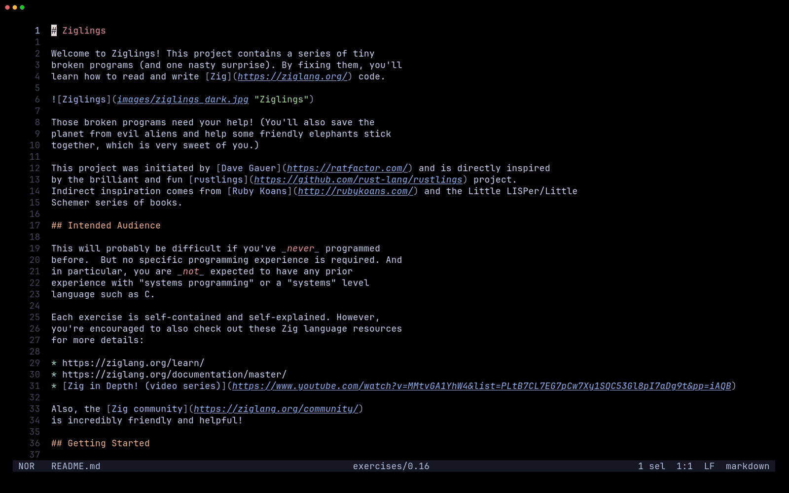

# forest.hx

forest.hx is a file tree explorer for [Helix](https://github.com/helix-editor/helix/), with two selectable styles: `snacks`, a persistent sidebar panel with an integrated fuzzy search bar (default), and `mini`, floating Miller columns with a live preview.

### 🍿 `snacks` style



<details>
<summary>🔍 <code>mini</code> style preview</summary>


</details>

---

## Installation

**1. Install the plugin-enabled fork of Helix** by following the instructions [here](https://github.com/mattwparas/helix/blob/steel-event-system/STEEL.md).

**2. Install forest.hx via forge:**

```sh
forge pkg install --git https://github.com/Ra77a3l3-jar/forest.hx.git
```

**3. Load the plugin** by adding this to your `init.scm`:

```scheme
(require "forest/forest.scm")

;; Optional: which side the tree renders on ('left by default)
;; (forest-configure! side)
(forest-configure! 'left)

;; Optional: which explorer UI forest-open uses ('snacks by default)
;; (forest-set-style! style)
(forest-set-style! 'snacks) ; or 'mini
```

Bind `:forest-open` to a key, e.g. in `init.scm`:

```scheme
(keymap (global)
        (normal (space (e ":forest-open"))))
```

---

## Usage

### `snacks` style

| Key | Action |
|-----|--------|
| `↑` / `↓` / `j` / `k` | Navigate |
| `Enter` | Open the selected file, or toggle the selected directory |
| `Tab` | Toggle the selected directory (outside search) |
| `/` | Start typing a fuzzy search query |
| `n` | Create a file or directory (end name with `/` for a directory) |
| `r` | Rename the selected entry |
| `d` | Delete the selected entry |
| `R` | Refresh the tree |
| `g` | Toggle dotfiles (`.env`, `.git`, etc.) |
| `i` | Toggle git-ignored entries |
| `+` / `-` | Widen / narrow the panel |
| `Esc` | Switch focus to the editor, panel stays open |
| `q` | Close the panel |

Opening or refocusing the tree reveals and centers whatever file is currently open in the editor.

### `mini` style

| Key | Action |
|-----|--------|
| `↑` / `↓` / `j` / `k` | Move within the active column |
| `→` / `l` / `Enter` | Open the selected file, or cascade into the selected directory |
| `←` / `h` | Back up to the parent column |
| `/` | Fuzzy search the whole workspace and jump to the match |
| `n` | Create a file or directory (end name with `/` for a directory) |
| `r` | Rename the selected entry |
| `d` | Delete the selected entry |
| `R` | Refresh the active column |
| `g` | Toggle dotfiles (`.env`, `.git`, etc.) |
| `i` | Toggle git-ignored entries |
| `+` / `-` | Widen / narrow the columns |
| `Esc` / `q` | Close |

Opening the tree reveals whatever file is currently open in the editor, cascading a column for each ancestor directory along the way.

## Notes

- Requires [notify.hx](https://github.com/chuwy/notify.hx) (pulled in automatically as a dependency) for create/rename/delete notifications.
- `.git`, `target`, `.direnv`, `node_modules`, `__pycache__`, and `.hg` are always hidden regardless of the `g`/`i` toggles. Dotfiles and git-ignored entries are hidden by default in both styles.
